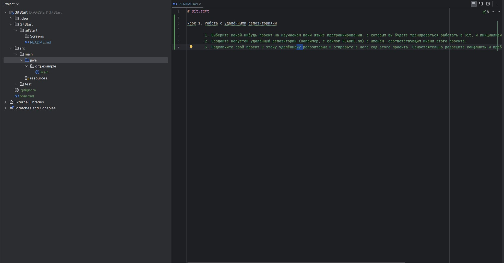

# gitStart

Урок 1. Работа с удалёнными репозиториями

        1. Выберите какой-нибудь проект на изучаемом вами языке программирования, с которым вы будете тренироваться работать в Git, и инициализируйте в папке этого проекта локальный репозиторий.
        2. Создайте непустой удалённый репозиторий (например, с файлом README.md) с именем, соответствующим имени этого проекта.
        3. Подключите свой проект к этому удалённому репозиторию и отправьте в него код этого проекта. Самостоятельно разрешите конфликты и проблемы, если они возникнут при выполнении данного задания.

        Я выбрал проект на Python для тренировки работы с Git.

1. Инициализируем локальный репозиторий:
   bash
   mkdir GitStart
   cd GitStart
   git init

2. Создаем непустой удаленный репозиторий на платформе Git с именем gitStart и файлом README.md.

3. Подключаем локальный репозиторий к удаленному репозиторию:
 
   bash
   git remote add origin https://github.com/GTrainee12/gitStart

4. Отправляем код проекта в удаленный репозиторий:
 
   bash
   git add .
   git commit -m "Initial commit"
   git push -u origin master

Здесь `.` добавляет все файлы в текущей директории в индекс.

